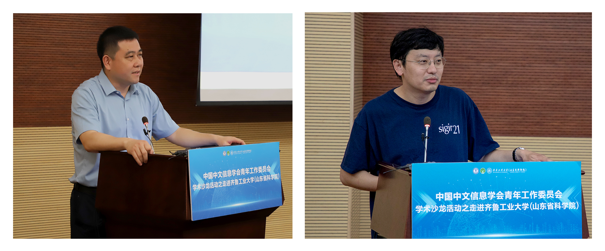

<!--# <i class="fas fa-award"></i>CIPS青工委学术沙龙活动之走进齐鲁工业大学（山东省科学院）成功举办！-->

Details: https://mp.weixin.qq.com/s?__biz=MzU3MDcyNDk0OQ==&tempkey=MTIyMF9xN2h3b0FOWFBPakpvcnQwZ2ZqTkVMMm5OOVFJaExnMWpJc0hCend0Wk5rN0gtVjVtWndJaVRUbWVxdUJONWw0OVJCX055MXVzQ094d2VSUnJma1ZyMWh4LUZWdkRoMFQxcW9JbU9VQlRkQ3VHLXVmc2RndVhZNVVkX3V1QjhJTEQySDBxWE1IWFZOanl6Nk5LMk5FUzhzdGxaRUNQX3JqSVVDU2J3fn4%3D&chksm=7cea43164b9dca00edb55a1a2a7bbcfcd927eb1c92c4502b048bb65247846831bfa206e48421&mpshare=1&scene=1&srcid=0531SEFxcY9gEIW7sHj0fdeS&sharer_sharetime=1685532419529&sharer_shareid=3604d492fab4024dea803c641f6b8b5c#wechat_redirect

2023年5月20日，应齐鲁工业大学（山东省科学院）计算学部自然语言处理与认知计算团队鹿文鹏教授的邀请，中国中文信息学会青年工作委员会在山东济南举办学术沙龙活动。出席活动的专家包括北京理工大学毛先领副教授、山东大学任昭春教授、清华大学刘知远副教授、哈尔滨工业大学刘铭教授、中国人民大学严睿副教授、中国科学院自动化研究所张家俊研究员、中国科学院计算技术研究所范意兴副研究员、北京麦伽智能科技有限公司联合创始人罗成博士、东南大学周德宇教授、中国科学技术大学徐童教授（以姓氏笔画为序）。来自齐鲁工业大学（山东省科学院）及山东省内兄弟院校的百余名老师和同学参加了此次学术沙龙活动；活动由上午8点30分持续至下午6点。

## 活动启幕:
 
 活动伊始，齐鲁工业大学（山东省科学院）计算学部主任、国家超级计算济南中心主任吴晓明研究员致开幕辞，热烈欢迎各位专家学者来访，并介绍了计算学部近年来的发展状况；计算学部拥有国家超级计算济南中心、算力互联网与信息安全教育部重点实验室，于2021年获批计算机科学与技术一级学科博士点，计算机学科在2022年软科排名中，位列全国第37位。山东大学任昭春教授对中国中文信息学会青年工作委员会的宗旨进行了介绍，并代表山东兄弟院校，向各位与会专家在疫情之后率先来访山东地区表示欢迎。

## 精彩报告:

 各位与会专家结合自己的研究成果，对自然语言处理领域的前沿热点问题，进行了精彩的报告。依据报告次序，具体介绍如下：

### 徐童-中国科学技术大学

- **报告题目**： 多模态语义学习
- **报告内容**： 随着信息采集手段与交互方式的日益丰富，越来越多的应用呈现出图像、文字、音视频等相互交融的多模态特性。然而，现有技术难以有效地从多模态信息中准确提炼并表达语义，从而限制了多模态智能应用的性能。徐童老师在报告中首先介绍了多模态语义学习的研究背景，然后介绍自己团队在多模态融合、结构化建模、语义理解应用三方面的研究内容，主要包括多模态融合应用于视觉任务、多模态融合应用于文本任务、抽象语义关系分类等，并结合现在的研究工作简要介绍相关选题思路与科研体会。最后，徐老师展望了如何进一步开展多模态知识学习的研究工作。
- **专家简介**：徐童，中国科学技术大学大数据学院特任教授、博士生导师，国家优秀青年科学基金获得者，担任中国中文信息学会青年工作委员会副秘书长。研究领域为数据挖掘与社交媒体分析。发表中国计算机学会推荐A类期刊/会议论文60余篇。主持国家、省部级科研项目及校企合作项目10余项。获2项国际学术会议最佳论文奖或提名，指导学生获国内外7项学术竞赛/测评冠军。受邀担任ACL 2023大会宣传主席及ACL、COLING、AACL、ICKG等国际会议领域主席。

### 周德宇-东南大学

- **报告题目**：面向网络虚假信息的事实验证模型及可解释性方法
- **报告内容**： 随着信息采集手段与交互方式的日益丰富，越来越多的应用呈现出图像、文字、音视频等相互交融的多模态特性。然而，现有技术难以有效地从多模态信息中准确提炼并表达语义，从而限制了多模态智能应用的性能。徐童老师在报告中首先介绍了多模态语义学习的研究背景，然后介绍自己团队在多模态融合、结构化建模、语义理解应用三方面的研究内容，主要包括多模态融合应用于视觉任务、多模态融合应用于文本任务、抽象语义关系分类等，并结合现在的研究工作简要介绍相关选题思路与科研体会。最后，徐老师展望了如何进一步开展多模态知识学习的研究工作。
- **专家简介**：周德宇，东南大学计算机学院、人工智能学院教授、博士生导师，担任中国中文信息学会理事、中文信息学会社会媒体处理专委会委员、医疗健康与生物信息处理专委会委员、计算机学会中文信息技术专委会委员。主要研究方向包括人工智能、自然语言处理，主要围绕信息抽取、舆情分析、文本聚类等，运用统计机器学习理论展开工作。担任《Frontiers of Computer Science》青年编委。主持完成国家自然科学基金项目3项、省部级项目3 项。发表论文80余篇，包括CCF-A 类论文20余篇，B 类论文20 余篇。

### 严睿-中国人民大学

- **报告题目**：智能人机对话技术探讨
- **报告内容**：智能人机对话系统利用自然语言处理等人工智能技术，使计算机能够理解和生成人类语言，并能够与人类用户进行自然而流畅的对话。严睿老师首先在报告中介绍了一种专为对话场景设计的对话神经主题模型 (ConvNTM)。现有的神经主题模型主要基于通用文档进行建模，而没有考虑不同的文本分析场景应具有不同的主题建模特征。与一般的文档主题建模不同，一个对话会持续多个轮次；每个短文本会话符合一个主题分布，并且这些主题分布在各个轮次间相互依赖。此外，对话中还包括不同的角色信息，也会影响对话中的主题分布。ConvNTM将以上因素考虑在内，通过将多轮次与多角色的公式化来进行对话主题建模，并利用词共现关系设计了一个新的训练目标，以进一步提高主题建模质量。随后，严老师针对神经对话模型所需的大量训练数据难以获取且耗费昂贵的问题，介绍了一种能更有效地利用现有训练样本的数据增强方法，并介绍了一种选择性数据增强框架（SDA）；SDA采用双重对抗网络选择质量较低且具有较好代表性的数据点进行增强，能够有效地提高各种指标的回复生成性能。在报告的最后，严老师对近期获得巨大成功的ChatGPT的技术路线进行了概要介绍，同时展望了未来人机对话系统的新挑战。
- **专家简介**：严睿，中国人民大学高瓴人工智能学院长聘副教授，博士生导师，入选北京智源人工智能研究院青年科学家，微软亚洲研究院铸星学者，中国人民大学杰出学者，获评北京大学王选青年教师奖，担任中国中文信息学会青年工作委员会执行委员。发表论文100余篇，引用9,800余次，主要研究方向为自然语言处理、文本挖掘、信息检索、机器学习和人工智能。曾多次担任多个顶级学术会议的领域审稿人/资深审稿人，也曾多次受邀于多个顶级学术会议宣讲Tutorial报告。

### 范意兴-中国科学院计算技术研究所

- **报告题目**：从流水式到生成式信息检索方法介绍
- **报告内容**：信息检索作为人们获取信息的重要手段，在日常生活和工作中起着关键作用。传统的信息检索系统通常采用“索引-检索-重排”的流水式架构，以平衡效率和效果。然而，随着预训练方法和生成式大模型的发展，生成式信息检索受到了广泛关注。生成式模型通过端到端的建模方式代替传统的流水式建模方式，展现出优异的性能和潜力。范意兴老师在本次报告中重点介绍了生成式信息检索的最新探索与进展。报告首先介绍并对比了流水式的检索架构和生成式检索架构各自的优势与不足，接着介绍在事实验证任务上的三项研究工作。首先，介绍了如何将所有的语料库知识统一编码到一个大模型中，以生成的方式为当前查询检索对应的相关文档和证据片段，有效提升检索性能；而后，介绍了一种同时支持不同搜索任务的统一生成式检索模型，可以有效综合不同任务的知识实现融会贯通提升检索性能；最后，还介绍了基于提示学习的统一生成检索器，将不同粒度的检索任务归一到统一的生成形式，在共享不同任务之间共有知识的同时，也能考虑不同任务之间的特异性。最后，范老师对现存的挑战进行了总结，包括增量学习问题、整合多模态信息的问题以及结果可解释可控的问题。
- **专家简介**：范意兴，中国科学院计算技术研究所副研究员，硕士生导师，曾获得中科院院长优秀奖，入选中国科协青年人才托举工程、中国科学院青年创新促进会会员，担任中国中文信息学会信息检索专委会委员。主要研究内容包括信息检索、自然语言处理等，在国际顶级学术会议SIGIR、WWW、CIKM等发表论文40余篇，获得了2017年CIKM最佳论文Runner-Up奖，2018年中国中文信息学会优秀博士论文奖。开发了深度文本匹配工具MatchZoo，在开源平台Github中得到研究人员的广泛使用与认可，累计获得4000多star，被国内外高校和企业广泛使用。

###   张家俊-中国科学院自动化研究所

- **报告题目**：大语言模型与多语言翻译
- **报告内容**：大语言模型在多项任务中均表现出很好的性能；但很多公开的大语言模型支持的语言很少，严重影响了大语言模型的多语翻译能力。在本次报告中，张家俊老师首先回顾了机器翻译的发展历程，介绍机器翻译在不同发展阶段的主要方法。然后，张老师从训练数据、模型框架、训练算法、评价方法和应用方式等五个方面对比了神经机器翻译和大模型机器翻译；通过一系列实验分析了大语言模型的多语言翻译能力，肯定了大模型在多语翻译方面的优势，但也指出了大模型多语翻译所面临的问题，即大语言模型绝大多数以英文为核心，支持的语言种类较少，无法充分施展大模型在多语翻译任务上的能力。接着，张老师详细介绍了以LLaMA-13B为基础模型在大模型的翻译能力拓展上的实践，分别采用了以下三个阶段进行拓展优化。第一阶段：以中文数据提升LLaMA的中文能力；第二阶段：以102种语言的双语平行数据提升LLaMA的多语言处理潜力；第三阶段：以多语言翻译指令微调数据激发LLaMA的多语言翻译能力。同时，张老师简要探讨了大语言模型时代机器翻译评价的问题，指出了BLEU值的缺点并建议采用GPT-4等更接近人类偏好的评价指标进行评价。最后，张老师对以上报告进行总结，并指出其下一步工作将研究如何借助其他方法解决和缓解大模型中非常严重的数据不平衡问题。
- **专家简介**：张家俊，中国科学院自动化研究所研究员、博士生导师，国家优秀青年科学基金获得者，入选中国科协青年人才托举工程、北京智源人工智能研究院青年科学家，担任中国中文信息学会理事、青年工作委员会主任和机器翻译专委会副主任。主要研究方向为机器翻译和自然语言处理。发表CCF-A/B类论文90余篇，出版学术专著2部、译著1部。获得中国中文信息学会钱伟长中文信息处理科学技术奖一等奖、青年创新奖一等奖和2020年北京市科学技术奖一等奖等。担任ACL/EMNLP/COLING的(资深)领域主席，担任IEEE/ACM T-ASLP、ACM TALLIP和《自动化学报》等期刊的编委。

### 刘知远-清华大学

- **报告题目**：大模型值得关注的特性
- **报告内容**：大模型是自然语言处理领域的热点问题。基于传统深度学习的模型只使用特定领域带标注的数据，因此只能适用于特定任务，不具备通用性和不同任务之间的迁移能力。与之不同，大模型通过引入大量参数以及大量数据进行学习，往往能够具备较好的通用性。尽管大模型近来被高度关注，但其本身也受到一些困扰。刘知远老师在报告中指出大模型的几个重要挑战，包括大模型微调难、计算复杂度高、无法利用外部工具、生成信息缺少依据等；通过对大模型的特性进行分析，讨论上述挑战的解决思路，具体包括：利用“四两拨千斤”的特点，对大模型进行少量参数的微调可获得全参数微调效果，解决大模型微调难的问题；利用“术业有专攻”的特点，受大模型稀疏激活现象的启发，对大模型进行细粒度功能模块分析，来解决大模型计算复杂度高的问题；利用“善假于物也”的特点，通过分析人类使用工具行为数据，使大模型能够模仿人类行为，来解决大模型无法利用外部复杂工具、生成信息缺少依据的问题，并介绍了对应的学习工具平台BMTools；利用“团结即力量”的特点，来解决应用模式受限的问题，并介绍了群体智能模拟平台AgentVerse；利用大模型通用性的特点来降低开发成本以及适配成本，并介绍了OpenBMB开源社区以及首个以中文为核心的基础模型CPM。最后，刘知远老师指出大模型的特性不只增量微调、稀疏模块、工具学习、群体智能、通用性这五个特性，还存在更多的特性等待研究者挖掘。
- **专家简介**：刘知远，清华大学计算机系长聘副教授、博士生导师，入选国家万人计划青年拔尖人才、中国科协青年人才托举工程、北京智源人工智能研究院青年科学家、Elsevier中国高被引学者、《麻省理工科技评论》中国区35岁以下科技创新35人榜单，曾担任中国中文信息学会青年工作委员会主任。主要研究方向为自然语言处理、知识图谱和社会计算。已在ACL、EMNLP、IJCAI、AAAI等人工智能领域的著名国际期刊和会议发表相关论文200余篇，Google Scholar统计引用超过3万次。

### 毛先领-北京理工大学

- **报告题目**：微观实体关系联合抽取方法研究
- **报告内容**：大规模知识图谱是现阶段人工智能发展的重要基石之一，实体识别和关系抽取是大规模知识图谱自动化构建的重要手段。现有实体关系抽取分为流水线式和联合抽取两类方法，流水线式方法存在交互缺失、错误传播的问题，为了克服流水线式方法存在的缺陷，近几年的工作通常采用联合抽取方法。在本次报告中，毛先领老师首先结合自己前期科技大数据挖掘方面的研究工作，阐述了大模型所带来的冲击，肯定了大模型的优势；但也通过一些应用实例，证明了在大模型时代很多特殊场景无法使用大模型，传统方法仍有很大的生存和应用空间。然后，毛老师着重介绍了课题组在实体关系联合抽取方面的研究工作。毛老师指出，对于传统实体关系联合抽取方法，从宏观角度来看，确实是能同步地实现联合抽取；但是从微观角度来看，仍然属于流水线式的形式，因此仍然存在错误传播的问题。面对这样的难题，毛老师课题组提出从微观角度实现同步抽取的联合抽取方法，并详细介绍了基于二部图匹配的单模块同步实体关系联合抽取方法和基于细粒度分类的单模块同步实体关系联合抽取方法。未来，毛老师课题组将进一步探索低资源领域高效适配的联合抽取方法。
- **专家简介**：：毛先领，北京理工大学副教授、博士生导师，担任中国中文信息学会青年工作委员会执行委员、计算机学会自然语言处理专委会委员、中文信息学会语言与知识专委会委员。主要研究信息检索与数据挖掘；已在SIGIR、WWW、SIGMOD、ACL、TOIS、TKDE等期刊会议上发表40余篇论文；部分成果获3项省部级科技进步奖。

## 交流讨论

 在交流讨论环节，现场的同学们与各位专家进行了热烈的讨论。通过与专家们的互动，同学们不仅拓宽了自己的学术视野，还深入了解了自然语言处理领域的最新动态和前沿技术，同时，还学习到了宝贵的科研经验和方法。

## 活动闭幕

 中国中文信息学会青年工作委员会主任张家俊研究员、齐鲁工业大学（山东省科学院）鹿文鹏教授对本次学术沙龙活动进行了简短的总结。感谢各位专家精心准备学术报告，展示各自的前沿研究成果，不仅为与会者带来了新的思考和启发，也推动了中文信息处理领域的发展和进步。本次学术沙龙活动，激发了同学们对中文信息处理的研究热情，扩大了中国中文信息学会青年工作委员会的影响力，取得了圆满成功。

## 合影留念

## 承办团队

**齐鲁工业大学（山东省科学院）自然语言处理与认知计算团队**

 自然语言处理与认知计算团队，依托于计算机科学与技术学部、国家超级计算济南中心、算力互联网与信息安全教育部重点实验室。团队面向国家和社会重大需求，聚焦于语言信息处理与多模态认知计算，重点探索文本语义分析、医疗健康信息处理与数据挖掘、多模态认知计算及推荐系统等领域的基础理论与关键技术。
 团队由中国科学院自动化研究所宗成庆研究员担任学术顾问，由鹿文鹏教授担任带头人，含教授2名、副教授4名、讲师2名，在读研究生40余名；团队学术氛围浓厚，先后主持国家自然科学基金项目4项、山东省自然科学基金7项，联合承担国家重点研发计划1项、山东省重大科技专项2项，发表CCF推荐列表及SCI期刊论文100余篇，取得授权发明专利70余项；研究成果获得山东省高等学校优秀科研成果奖2项，山东省科技进步奖1项；教学成果获得山东省人工智能学会高等教育教学成果一等奖1项；团队悉心培养优秀学子，多名同学顺利考取悉尼科技大学、北京理工大学、武汉大学、华中科技大学、北京邮电大学、东南大学、北京交通大学、华南师范大学等双一流高校博士生。
 团队秉承齐鲁工业大学（山东省科学院）“明德励志、崇实尚能”的校训，努力开拓进取，力争逐步将团队建设成为自然语言处理领域开展基础研究和技术研发的高水平实验室。
